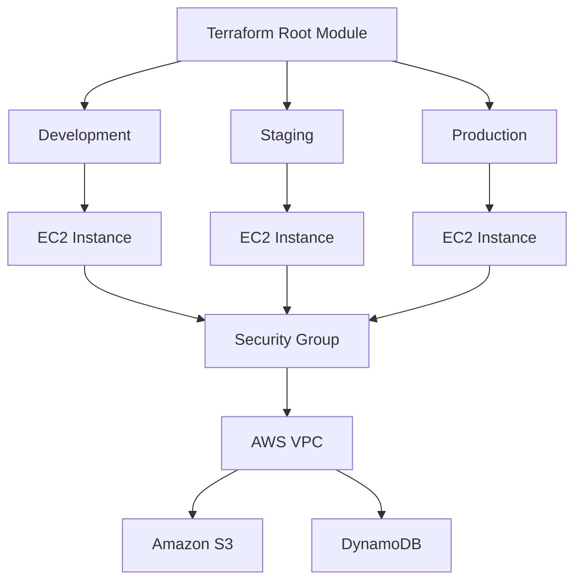
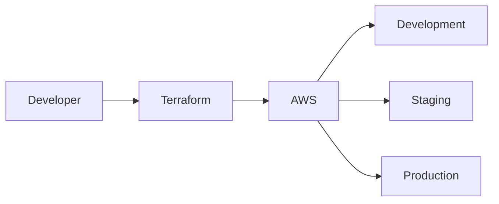

<div align="center">

# 🚀 AWS Multi-Environment Infrastructure with Terraform Modules


<br>


</div>

---

# 📖 Project Overview

This project demonstrates how to provision **Development**, **Staging**, and **Production** environments on **AWS** using **Terraform Modules**.

Instead of writing infrastructure repeatedly, a reusable Terraform module is created once and instantiated multiple times for different environments.

---

# ✨ Features

- 🚀 Multi-Environment Infrastructure
- 📦 Reusable Terraform Modules
- ☁️ AWS EC2 Provisioning
- 🔐 Security Groups
- 🌐 AWS VPC
- 🪣 Amazon S3
- 🗄️ DynamoDB
- 📄 Variables & Outputs
- ⚡ Infrastructure as Code (IaC)

---

# 🏗 Architecture



---

# 📂 Project Structure

```text
.
├── README.md
├── main.tf
├── .gitignore
│
└── infra-module-app
    ├── ec2.tf
    ├── security-group.tf
    ├── s3.tf
    ├── dynamodb.tf
    ├── variables.tf
    └── outputs.tf
```

---

# 🌍 Environments

| Environment | Instance Count | Purpose |
|-------------|---------------:|----------|
| 🟢 Development | 1 | Development & Testing |
| 🟡 Staging | 1 | Pre-Production Validation |
| 🔴 Production | 2 | Live Production |

---

# 🚀 Deployment

## Initialize Terraform

```bash
terraform init
```

## Validate

```bash
terraform validate
```

## Format

```bash
terraform fmt
```

## Plan

```bash
terraform plan
```

## Apply

```bash
terraform apply
```

## Destroy

```bash
terraform destroy
```

---

# 📚 Technologies Used

- Terraform
- AWS EC2
- AWS VPC
- Amazon S3
- DynamoDB
- Security Groups
- Infrastructure as Code (IaC)

---

# 🎯 Learning Outcomes

This project helped me understand:

- Terraform Modules
- Variables
- Outputs
- Resource Reusability
- Multi-Environment Infrastructure
- AWS Infrastructure Provisioning
- Infrastructure Automation
- Infrastructure as Code Best Practices

---

# 📈 Future Improvements

- Terraform Remote Backend (S3 + DynamoDB)
- GitHub Actions CI/CD
- Jenkins Pipeline
- Docker Integration
- Kubernetes Deployment
- Ansible Automation
- Prometheus & Grafana Monitoring
- Auto Scaling Groups
- Load Balancer
- Route53
- ACM SSL Certificates

---

# 📸 Project Workflow



---

# 🌟 Repository

If you found this project useful, consider giving it a ⭐.

---

<div align="center">

## 👨‍💻 Author

### **Shubham Kothari**

💻 DevOps Engineer | AWS Cloud Enthusiast

Terraform • Docker • Kubernetes • Jenkins • Linux • Git • AWS

---

### 🚀 Happy Terraforming!

</div>
